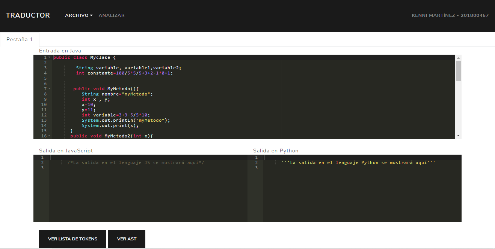
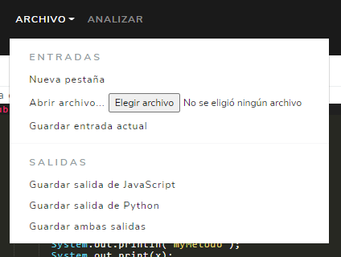
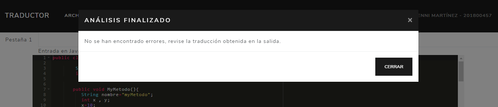
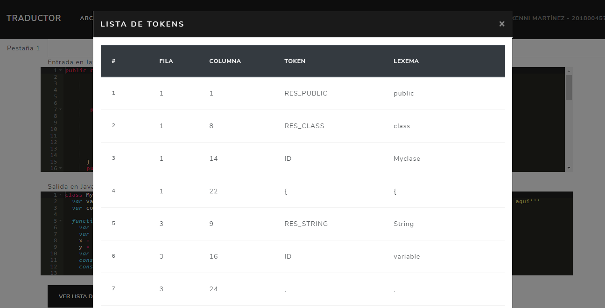
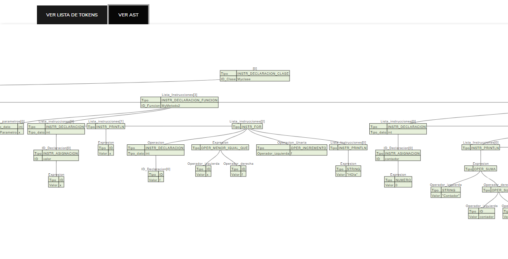

# MANUAL DE USUARIO "TRANSLATOR IN DOCKER"

## Iniciando la aplicación

1. Dentro de la carpeta frontend, ejecutar el comando `go run main.go`, el servidor para la visualización de la aplicación se iniciará.
2. Dirigirse a la carpeta backendJS, ejecutar el comando `npm run dev`, el servidor se iniciará.
3. En el navegador, ingresar a `localhost:1500`

Se visualizará la siguiente aplicación:

Por defecto, iniciará con una entrada de muestra, dentro del menú Archivo se contará con varias opciones:
+ Nueva pestaña: crea una nueva pestaña dentro del editor.
+ Abrir archivo: abre una ventana de diálogo en la que se puede cargar un archivo con extensión .java que se encuentre dentro de su ordenador.
+ Guardar entrada actual: descarga un archivo .java con la sesión actual
+ Guardar salida de JavaScript: genera un archivo .js con la traducción obtenida.
+ Guardar salida de Python: genera un archivo .py con la traducción obtenida
+ Guardar ambas salidas: genera las dos salidas anteriores con un solo clic.

Al pulsar el botón analizar se realizará el análisis léxico y sintáctico de la sesión actual.

Si no se encuentran errores se mostrará una ventana emergente, mencionando que se ha procedido con la traducción:

Puede revisar las traducciones dentro de las consolas de cada salida.
> Si se encuentra un error léxico o sintáctico NO se realizará la traducción, así que verifique el archivo se encuentre correctamente escrito.

Debajo de las consolas se podrán ver los siguientes botones:
+ Ver lista de Tokens: muestra dentro de una ventana emergente los tokens obtenidos durante el análisis.

+ Ver AST: despliega un visualizador en donde se puede observar y desplazarse dentro del árbol. Se puede hacer zoom si uno desea. Para guardar el visualizador, solo basta con volver a pulsar el botón.

